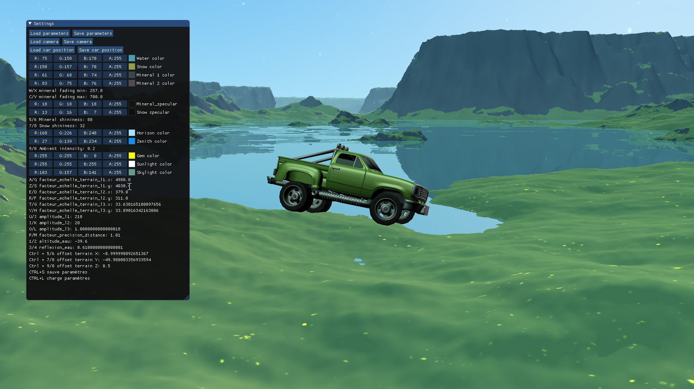
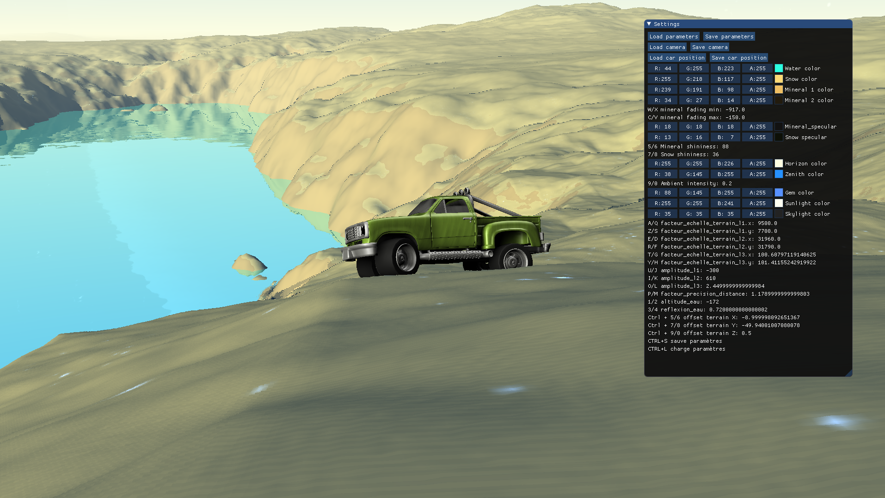
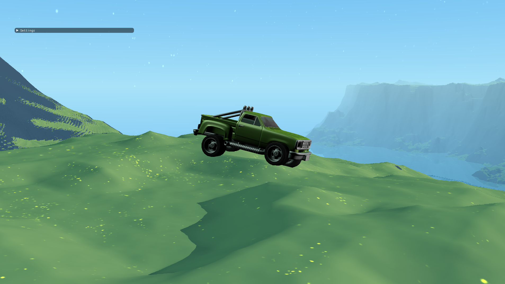
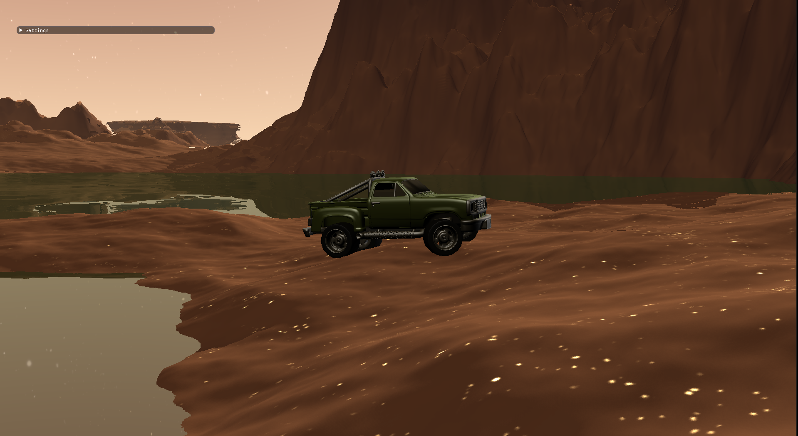
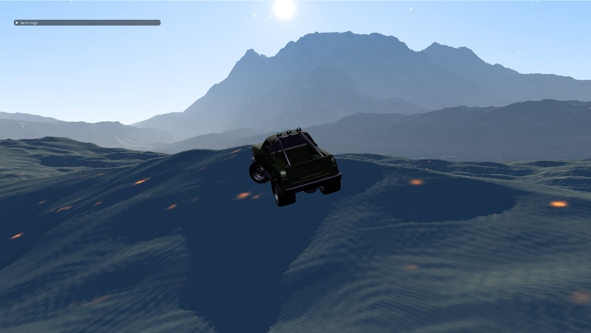

# RaycastCar_RaymarchTerrain

### In this POC, you can drive a raycast-car in a raymarched terrain.

Created in Python 3 using the [HARFANG 3D 1.2.0 framework](https://www.harfang3d.com).

## How to run [Windows]

- Install [Python 3.5](https://www.python.org/downloads/release/python-350/)
- Run `install_harfang_python.bat` batch. This will install HARFANG3D 1.2.0.
- Open console in root dir and type command `python35 main.py`

## Screenshots

  
  
  

